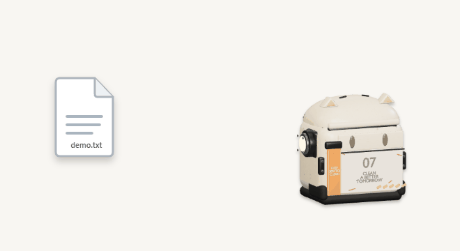
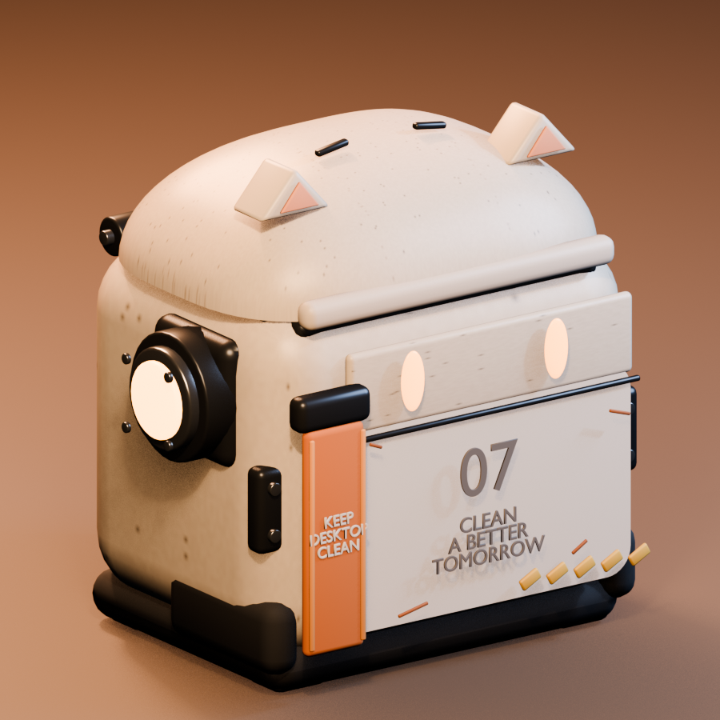
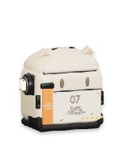
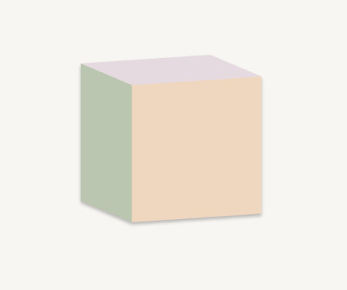

# Cat Recycle Bin · 猫耳回收站

[English](#english) · [简体中文](#简体中文)

A tiny animated Windows Recycle Bin, extracted from the cat bin in Desktop Creatures. / 从 Desktop Creatures 独立出来的猫耳桌面回收站。



The GIF is an illustrated UI preview. The still image below is captured from the actual Windows app. / GIF 为交互演示动画；下方静态图截取自实际运行的 Windows 程序。

| 3D model preview / 模型预览 | Running Windows app at 200% / 200% 尺寸实际运行 | Custom model preview / 替换模型预览 |
| --- | --- | --- |
|  |  |  |

## English

### Features

- Drop files, folders, or multiple selected items from File Explorer into the bin to request a move to the **Windows Recycle Bin**.
- Hover to open the lid. The original 3D model, sounds, movable desktop position, and happy expression after a successful drop remain intact.
- Double-click to open the system Recycle Bin. Right-click the bin or use its tray icon for settings and exit.
- **Confirm before recycling** is on by default and can be turned off. The preference is saved.
- Choose 100%, 150%, 200%, or 300% display size. The default is 200%; 100% restores the original 76 × 88 window. The renderer also uses extra pixel sampling for cleaner edges.
- Choose **Change 3D model (GLB)** from the bin or tray menu to import a self-contained glTF 2.0 `.glb` file. The app copies it into its own settings directory, fits it automatically, and keeps it after restart. The first animation, when present, responds to hover. Choose **Restore default cat model** to switch back.

### Download and use

Download the Windows ZIP from [Releases](https://github.com/AdrianZhaoDev/cat-recycle-bin/releases/latest), extract it, and run `cat-recycle-bin.exe`. WebView2 is required. Move the bin by dragging it with the left mouse button.

The app accepts real file-system paths on fixed local disks. It refuses network and removable volumes, drive roots, paths inside the Recycle Bin, its own executable and configuration data, and overlapping parent/child paths in one drop. If Windows cannot recycle an item, it may show a separate **permanent deletion** warning; cancel that system warning if you need the item to remain recoverable.

To try model replacement, download [the sample color cube](examples/color-cube.glb), then right-click the bin and select **Change 3D model (GLB)**. Use the menu to import models; dropping a file onto the bin requests recycling. GLB files must contain their textures and data and be at most 25 MB. The model changes the appearance; recycling behavior and settings remain available.

### Build from source

On Windows, install Node.js 24, the Rust MSVC toolchain, and WebView2:

```powershell
npm ci
npm run check
cargo test --manifest-path src-tauri/Cargo.toml --lib
npm run desktop:build -- --no-bundle
```

The executable is written to `src-tauri/target/release/cat-recycle-bin.exe`. The Tauri app has its own identifier and settings directory; the original game is not needed.

## 简体中文

### 功能

- 从资源管理器拖入文件、文件夹或多个选中项目，程序请求将它们移入 **Windows 系统回收站**。
- 悬浮开盖，保留原有的 3D 模型、音效、桌面位置拖动，以及回收成功后的开心表情。
- 双击打开系统回收站；右键垃圾桶或点击托盘图标可打开设置和退出。
- **删除前提醒** 默认开启，可关闭，设置会保存。
- 可选 100%、150%、200%、300% 尺寸。默认 200%；100% 是原来的 76 × 88 窗口。渲染器同时提高内部采样，改善边缘清晰度。
- 在垃圾桶右键菜单或托盘菜单选择 **更换 3D 模型（GLB）**，可导入独立的 glTF 2.0 `.glb` 文件。程序会复制到自己的配置目录，自动居中缩放，重启后继续使用；如果模型带动画，第一段动画会响应悬浮。选择 **恢复默认猫咪模型** 即可切回。

### 下载与使用

从 [Releases](https://github.com/AdrianZhaoDev/cat-recycle-bin/releases/latest) 下载 Windows ZIP，解压后运行 `cat-recycle-bin.exe`。需要 WebView2。按住左键拖动垃圾桶即可调整位置。

程序接收固定本地磁盘上具有实际路径的文件和文件夹。网络位置、可移动卷、磁盘根目录、回收站内部、程序及配置数据，以及同批次重复或父子重叠的路径会被拒绝。如果 Windows 无法将项目放入回收站，系统可能另弹 **永久删除** 警告；想保留可恢复性时，请取消该系统警告。

可以先下载[彩色立方体示例](examples/color-cube.glb)，右键垃圾桶选择 **更换 3D 模型（GLB）** 试用。请通过菜单导入模型；把文件拖入垃圾桶仍会请求回收。GLB 需要自带纹理与数据，大小不超过 25 MB。替换的是外观，回收功能与设置继续可用。

### 从源码构建

在 Windows 上准备 Node.js 24、Rust MSVC 工具链和 WebView2：

```powershell
npm ci
npm run check
cargo test --manifest-path src-tauri/Cargo.toml --lib
npm run desktop:build -- --no-bundle
```

EXE 位于 `src-tauri/target/release/cat-recycle-bin.exe`。本项目使用独立的应用标识和设置目录，不依赖原游戏运行。

## License / 许可

The application code is released under [MIT](LICENSE). The original model, icon, and sounds are covered by [ASSET-LICENSE.txt](ASSET-LICENSE.txt); editable Blender source and generation records are included. Third-party components retain their own licenses; see [third-party notices](THIRD-PARTY-NOTICES.txt).

程序代码使用 [MIT 许可](LICENSE)。原创模型、图标和音效见 [ASSET-LICENSE.txt](ASSET-LICENSE.txt)；仓库保留可编辑的 Blender 源文件及生成记录。第三方组件见[许可说明](THIRD-PARTY-NOTICES.txt)。
